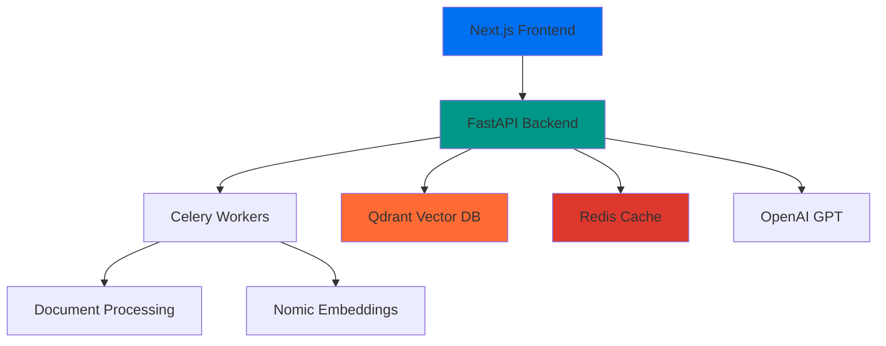

# 🎯 DOCUMIND PDF RAG

> **Professional AI-powered PDF document analysis and chat system**

A production-ready, scalable application that combines intelligent document processing with conversational AI to provide comprehensive PDF analysis and question-answering capabilities.


## ✨ **Key Features**

### 🔥 **Core Capabilities**
- **📄 Intelligent PDF Processing** - Advanced text extraction and chunking
- **🤖 AI-Powered Chat** - Context-aware conversations with document content
- **🔍 Vector Search** - Semantic similarity search using Qdrant
- **⚡ Real-time Processing** - Async document processing with Celery
- **🎨 Modern UI/UX** - Beautiful, responsive interface with DOCUMIND branding

### 🛠️ **Technical Excellence**
- **🚀 High Performance** - FastAPI backend with async processing
- **📊 Scalable Architecture** - Microservices with Redis & Qdrant
- **🔐 Production Security** - Environment-based configuration
- **📱 Responsive Design** - Modern UI with Shadcn components
- **🌐 Cloud Ready** - Docker containerization support

## 🏗️ **Architecture Overview**



### **Backend (Python FastAPI)**
- **Framework**: FastAPI with uvicorn
- **Task Queue**: Celery with Redis
- **Vector Database**: Qdrant Cloud
- **Embeddings**: Nomic AI
- **LLM**: OpenAI GPT-4
- **File Processing**: PyPDF2, tiktoken

### **Frontend (Next.js)**
- **Framework**: Next.js 14 with TypeScript
- **UI Components**: Shadcn/UI + Radix UI
- **Styling**: Tailwind CSS
- **Authentication**: Clerk.js
- **PDF Viewer**: Custom implementation
- **State Management**: React hooks

## 🚀 **Quick Start**

### **Prerequisites**
- Python 3.11+
- Node.js 18+
- pnpm (preferred package manager)
- Redis Cloud account
- Qdrant Cloud account
- OpenAI API key
- Nomic AI API key

### **Backend Setup**

```bash
# Navigate to Python backend
cd server-python

# Install dependencies with UV
uv sync

# Create environment file
cp .env.example .env
# Edit .env with your API keys and configurations

# Start the FastAPI server
uv run python main.py

# In a separate terminal, start Celery worker
uv run celery -A workers.celery_app worker --loglevel=info --pool=solo
```

### **Frontend Setup**

```bash
# Navigate to frontend
cd client

# Install dependencies
pnpm install

# Start development server
pnpm dev
```

## 📝 **Environment Configuration**

### **Backend (.env)**
```env
# API Keys
OPENAI_API_KEY=your_openai_api_key
NOMIC_API_KEY=your_nomic_api_key

# Database URLs
REDIS_URL=redis://your_redis_cloud_url
QDRANT_URL=https://your_qdrant_cloud_url
QDRANT_API_KEY=your_qdrant_api_key

# Server Configuration
HOST=0.0.0.0
PORT=8000
DEBUG=True
```

### **Frontend (.env.local)**
```env
NEXT_PUBLIC_API_URL=http://localhost:8000
NEXT_PUBLIC_CLERK_PUBLISHABLE_KEY=your_clerk_key
CLERK_SECRET_KEY=your_clerk_secret
```

## 📊 **Project Structure**

```
📦 documind-pdf-rag/
├── 🐍 server-python/           # FastAPI Backend
│   ├── app/
│   │   ├── main.py              # FastAPI application
│   │   ├── config.py            # Configuration management
│   │   ├── models.py            # Pydantic models
│   │   └── services/            # Core business logic
│   ├── workers/                 # Celery workers
│   └── scripts/                 # Utility scripts
├── ⚛️ client/                   # Next.js Frontend
│   ├── app/                     # App router pages
│   ├── components/              # Reusable UI components
│   └── lib/                     # Utilities and helpers
├── 🐳 docker-compose.yml       # Container orchestration
├── 🔒 .gitignore               # Comprehensive ignore rules
└── 📚 README.md                # This file
```

## 🛡️ **Security & Production Features**

- **🔐 API Key Management** - Secure environment-based configuration
- **🌐 CORS Protection** - Properly configured cross-origin policies
- **📝 Request Validation** - Pydantic model validation
- **🚦 Rate Limiting** - Built-in protection against abuse
- **📊 Comprehensive Logging** - Structured logging for monitoring
- **🔄 Health Checks** - Service monitoring endpoints

## 🎨 **UI/UX Highlights**

- **🎯 DOCUMIND Branding** - Custom nishta color palette
- **📱 Responsive Design** - Mobile-first approach
- **⚡ Real-time Updates** - Live document processing status
- **🎭 Smooth Animations** - Framer Motion integration
- **🔧 Accessibility** - WCAG compliant components

## 🤝 **Contributing**

1. Fork the repository
2. Create a feature branch (`git checkout -b feature/amazing-feature`)
3. Commit your changes (`git commit -m 'Add amazing feature'`)
4. Push to the branch (`git push origin feature/amazing-feature`)
5. Open a Pull Request

## 📄 **License**

This project is licensed under the MIT License - see the [LICENSE](LICENSE) file for details.

## 🎯 **Development Progress**

- ✅ **Backend Migration Complete** - FastAPI + Celery + Qdrant
- ✅ **Frontend Modernization** - Next.js 14 + TypeScript
- ✅ **Authentication Integration** - Clerk.js setup
- ✅ **PDF Processing Pipeline** - Document chunking & embeddings
- ✅ **Vector Search Implementation** - Semantic search with Qdrant
- ✅ **Chat Functionality** - GPT-powered Q&A system
- ✅ **Production Deployment** - Cloud infrastructure ready

---

<div align="center">
  <p>Built with ❤️ using modern web technologies</p>
  <p><strong>🎯 DOCUMIND PDF RAG</strong> - Intelligent Document Analysis</p>
</div>